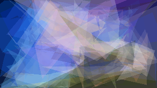

# PolyEvolve 2D

Inspired by Roger Alsing's [Evolution of Mona Lisa](https://rogerjohansson.blog/2008/12/07/genetic-programming-evolution-of-mona-lisa/), this project uses a genetic algorithm to approximate an image using a few polygons.

---

## Current Results

<table>
  <tr>
    <td align="center">
       
      <b>Majestic Unicorn (original)</b>
    </td>
    <td align="center">
       
      <b>Majestic Unicorn (generated)</b>
    </td>
  </tr>
</table>

---

## Features & Status

### Status
The [first approach](https://github.com/POACH3/PolyEvolve-2D/tree/main/version_1) has been abandoned (for now) due to lack of convergence to a good approximation, despite significant simplification of target images and parameter experimentation.

The results of the [second approach](https://github.com/POACH3/PolyEvolve-2D/tree/main/version_2) are crude, but a significant improvement over version 1.

### Planned Features
- a simple GUI
- parameter adjustment
  - set number of generations
  - set population size
  - fix number of polygons
  - fix or select range of number of polygon edges
  - fix color and opacity or set a palette
  - fix opacity
  - allow transparency
  - set background color and opacity
- circles
- parallelize via multiprocessing
  - fitness measurement
  - clone mutation

<!--
### Known Limitations
- **Slow**: Need to change the loss calculation
-->
---

## Project Info
**Author:** T. Stratton  
**Start Date:** 30-MAR-2025  
**License:** MIT License – see [LICENSE](./LICENSE)  
**Language:** Python 3.11+ (tested on 3.11)  
**Status:** Alpha (experimental)  
**Topics:** ai, genetic-ai, genetic-algorithm, image-approximation